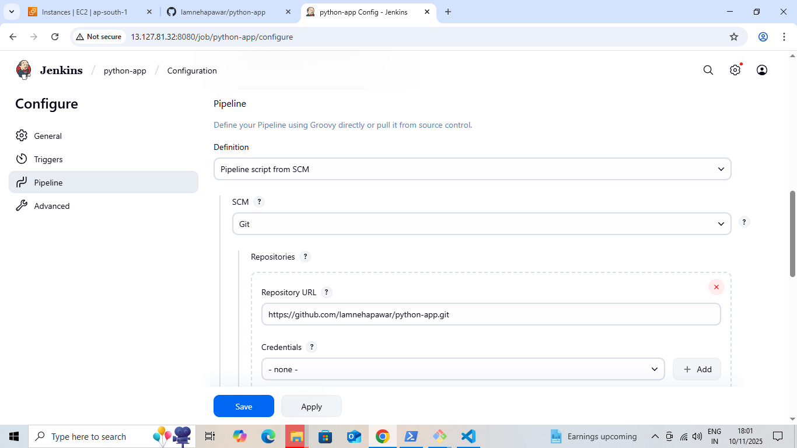
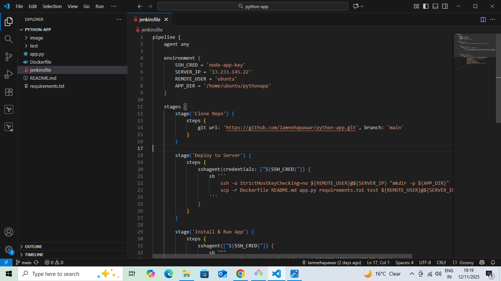
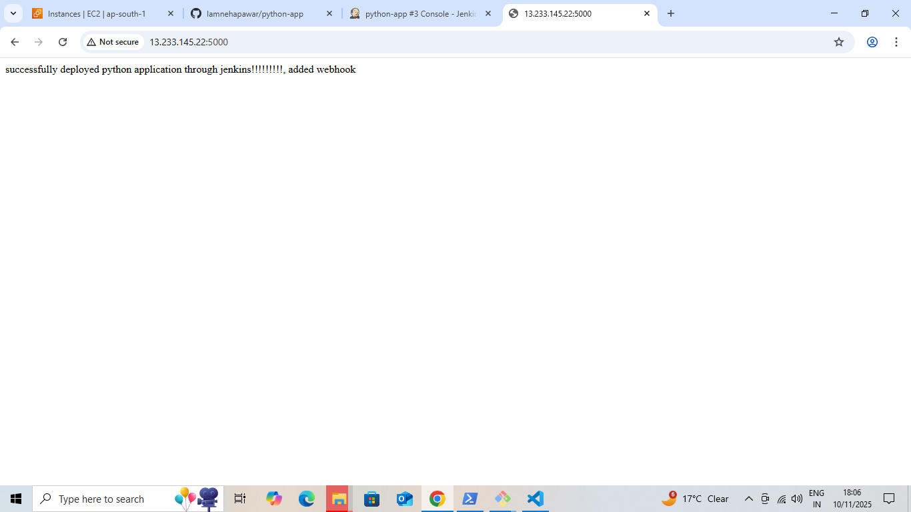

# #  Python Application - Fully Automated CI/CD Pipeline with Jenkins & AWS EC2

This project demonstrates a **fully automated CI/CD pipeline** for a Python application using Jenkins, GitHub, and AWS EC2. The pipeline automatically deploys the application to a deployment server.

---

##  Project Architecture

GitHub Repository → Jenkins Server (Build & Deploy) → EC2 Deployment Server (Run App using PM2)

| EC2 Instance | Role |
|--------------|------|
| Instance 1 | Jenkins CI/CD Server |
| Instance 2 | Application Deployment & Execution Server |

---

##  CI/CD Pipeline Overview

### Prerequisites

**For both EC2 instances:**

| Software | Purpose |
|----------|---------|
| Python3/pip | To run the application |
| Git | Code cloning and version control |
| OpenSSH | SSH communication |

**Additional for Jenkins Server:**

| Software | Purpose |
|----------|---------|
| Jenkins | CI/CD automation |
| Required Plugins | Secure deployment |

**Additional for Deployment Server:**

| Software | Purpose |
|----------|---------|
| PM2 | Run and monitor Python application |
| python3-venv | Create Python virtual environments |

---

##  Project Structure

python-app-CICD/
│── app.py
│── requirements.txt
│── Dockerfile
│── README.md
│── Jenkinsfile
└── test/

---

##  Deployment Server (EC2) Setup

1. Launch a new **EC2 Ubuntu instance**.  
2. Connect via SSH.  
3. Install necessary tools:

sudo apt update

sudo apt install -y python3 python3-venv 

python3-pip npm git

sudo npm install -g pm2

### 4.Create a directory for the application:

mkdir -p /home/ubuntu/pythonapp

## Jenkins Pipeline Setup

1.Login to the Jenkins server.

2.Navigate to Manage Jenkins → Credentials → Add Credentials

Type: SSH Username with Private Key

ID: node-app-key

Username: ubuntu

Private Key: (Paste your PEM key)

3.Create a new Pipeline Job → Pipeline script from SCM

## 4.Repository URL:
https://github.com/Iamnehapawar/python-app.git

5.Branch: main

6.Save and Build

## Jenkinsfile

## Push Code to GitHub

1.Create a new GitHub repository for the project.

2.Add all project files including app.py and Jenkinsfile.

3.Commit and push the code

## Final Result
Automatic Deployment: The application is deployed automatically on every Git push using Jenkins + PM2.

Monitoring: PM2 allows monitoring the running state of the application.

## Conclusion:
Automatic Deployment: Git push → Jenkins deploys app automatically.

Monitoring: PM2 monitors and restarts the app if needed.

Extensible: Add tests, Docker, or AWS services easily.

References: GitHub, Jenkins docs, PM2 docs, AWS docs.

- Author: Neha Pawar
- GitHub: https://github.com/Iamnehapawar